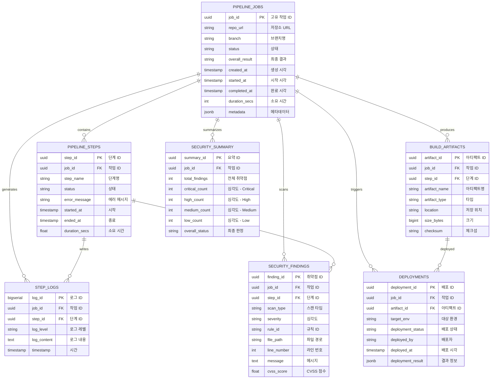

# 노션 업로드 가이드: CI/CD Database 설계

> 이 파일은 Notion에 붙여넣기 위해 최적화되었습니다.
> 섹션별로 복사해서 Notion 블록에 붙여넣으면 됩니다!

---

## 📌 노션 작성 순서

1. Notion 새 페이지 생성
2. 제목: "CI/CD Database 설계" 
3. 아래 내용을 섹션별로 복붙
4. ER 다이어그램 이미지 추가 (파일 제공)
5. 각 섹션별로 toggle 또는 heading으로 정렬

---

# 📊 ER 다이어그램

## 노션 삽입 방법:

### 방법 1: 이미지로 삽입 (추천)
```
아래 텍스트를 이용해 온라인 Mermaid 렌더러에서 다이어그램 생성:
https://mermaid.live 또는 https://app.diagrams.net 에서 이미지로 변환 후 업로드

또는 

방법 2: 코드 블록으로 삽입
Notion에서 "코드 언어: mermaid" 선택 후 아래 코드 붙여넣기
```

### Mermaid 코드 (erDiagram.txt로 저장됨):


---

## 텍스트 다이어그램 (Notion 텍스트로 표현)

```
┌─────────────────────────────┐
│    PIPELINE_JOBS            │
│  (파이프라인 작업 - 중심)    │
│  - job_id (PK)              │
│  - repo_url, branch         │
│  - status, overall_result   │
│  - created_at, completed_at │
└──────────────┬──────────────┘
               │
    ┌──────────┼─────────────────────────────┐
    │          │                              │
    ▼          ▼                              ▼
┌──────────┐ ┌──────────────┐  ┌──────────────────────┐
│  STEPS   │ │  LOGS        │  │ SECURITY_FINDINGS    │
│  (7개)   │ │ (상세 로그)  │  │ (gitleaks/semgrep)   │
│ - step_1 │ │ - log_level  │  │ - severity           │
│ - step_2 │ │ - content    │  │ - rule_id            │
│ - step_3 │ │ - timestamp  │  │ - file_path          │
│ ...      │ └──────────────┘  │ - cvss_score         │
└──────────┘                    └──────────────────────┘
    │
    └──────────┬──────────────┐
               │              │
               ▼              ▼
        ┌─────────────┐  ┌──────────────────┐
        │ ARTIFACTS   │  │ DEPLOYMENTS      │
        │ (빌드결과)  │  │ (배포 이력)      │
        │ - location  │  │ - target_env     │
        │ - size_bytes│  │ - deploy_status  │
        │ - checksum  │  │ - deployed_at    │
        └─────────────┘  └──────────────────┘
                               │
                               ▼
                        ┌──────────────────┐
                        │ SECURITY_SUMMARY │
                        │ (요약 - 캐시)    │
                        │ - total_findings │
                        │ - critical_count │
                        │ - overall_status │
                        └──────────────────┘
```

---

# 📋 CI/CD Database 설계 상세

## 1️⃣ 개요

### 목표
- CI/CD 파이프라인의 모든 작업, 로그, 보안 결과, 배포 이력을 **영구 저장**
- 파이프라인 진행 상황 **실시간 추적**
- 보안 이슈 분석 및 이력 관리
- 성능 최적화

### 핵심 특징
- **7개 테이블**: 파이프라인 작업 → Step → 로그 → 보안 → 빌드 → 배포
- **UUID 기반 ID**: 분산 시스템 대응
- **JSONB 메타데이터**: 유연한 데이터 저장
- **50개+ 인덱스**: 조회 성능 최적화
- **자동 집계**: security_summary 트리거로 자동 업데이트

---

## 2️⃣ 7개 핵심 테이블

### 테이블 1: pipeline_jobs
**역할**: 각 CI/CD 작업의 최상위 정보 (한 번의 파이프라인 = 1개 job)

| 칼럼 | 타입 | 설명 |
|-----|------|------|
| job_id | UUID | 고유 작업 ID (PK) |
| repo_url | VARCHAR(2048) | GitHub 저장소 URL |
| branch | VARCHAR(255) | 브랜치명 (기본값: main) |
| status | job_status | 상태: queued, running, success, failed, cancelled |
| overall_result | VARCHAR(20) | 최종 결과: success, failed |
| created_at | TIMESTAMP | 작업 생성 시각 |
| started_at | TIMESTAMP | 작업 시작 시각 |
| completed_at | TIMESTAMP | 작업 완료 시각 |
| duration_secs | INTEGER | 총 소요 시간 (초) |
| metadata | JSONB | 추가 정보 (requester_id, commit_hash 등) |

**인덱스**:
- idx_pipeline_jobs_status (조회 성능)
- idx_pipeline_jobs_created_at (최신순 조회)
- idx_pipeline_jobs_branch (브랜치별 검색)

---

### 테이블 2: pipeline_steps
**역할**: 파이프라인 내 각 단계의 실행 결과

| 칼럼 | 타입 | 설명 |
|-----|------|------|
| step_id | UUID | 단계 ID (PK) |
| job_id | UUID | 작업 ID (FK → pipeline_jobs) |
| step_name | VARCHAR(100) | 단계명: clone, install, test, build, deploy 등 |
| status | step_status | 상태: pending, running, success, failed, skipped |
| error_message | TEXT | 실패 시 에러 메시지 |
| started_at | TIMESTAMP | 단계 시작 시각 |
| ended_at | TIMESTAMP | 단계 종료 시각 |
| duration_secs | FLOAT | 단계 소요 시간 (초) |
| metadata | JSONB | 단계별 상세 정보 |

**인덱스**:
- idx_pipeline_steps_job_id (Job별 Step 조회)
- idx_pipeline_steps_status (상태별 검색)

---

### 테이블 3: step_logs
**역할**: 각 Step 실행 중 생성되는 상세 로그

| 칼럼 | 타입 | 설명 |
|-----|------|------|
| log_id | BIGSERIAL | 로그 ID (PK) |
| job_id | UUID | 작업 ID (FK) |
| step_id | UUID | 단계 ID (FK) |
| log_level | VARCHAR(10) | 레벨: debug, info, warn, error |
| log_content | TEXT | 로그 내용 (최대 5000자/배치) |
| timestamp | TIMESTAMP | 로그 기록 시각 |

**저장 전략**:
- 로그 배치 저장: 100줄 단위로 묶어서 INSERT (성능 최적화)
- 한 번에 매 라인마다 INSERT하지 않음

**인덱스**:
- idx_step_logs_job_timestamp (Job별 로그 시간순 조회)

---

### 테이블 4: security_findings
**역할**: gitleaks (경량 스캔) + semgrep (심화 스캔) 결과 저장

| 칼럼 | 타입 | 설명 |
|-----|------|------|
| finding_id | UUID | 취약점 ID (PK) |
| job_id | UUID | 작업 ID (FK) |
| step_id | UUID | 단계 ID (FK) |
| scan_type | scan_type | 스캔 타입: gitleaks, semgrep |
| severity | severity_level | 심각도: critical, high, medium, low |
| rule_id | VARCHAR(255) | 규칙 ID (예: slack-bot-token) |
| rule_name | VARCHAR(500) | 규칙 이름 (예: Slack Bot Token) |
| file_path | VARCHAR(2048) | 파일 경로 |
| line_number | INTEGER | 라인 번호 |
| column_number | INTEGER | 칼럼 번호 (optional) |
| message | TEXT | 취약점 설명 |
| code_snippet | TEXT | 해당 코드 스니펫 |
| cwe_id | VARCHAR(20) | CWE ID (예: CWE-506) |
| cvss_score | FLOAT | CVSS 점수 (0.0~10.0) |
| is_masked | BOOLEAN | 민감정보 마스킹 여부 |
| created_at | TIMESTAMP | 발견 시각 |

**인덱스**:
- idx_security_findings_job_id (Job별 취약점 조회)
- idx_security_findings_severity (심각도별 검색)
- idx_security_findings_job_severity (Job + 심각도 복합 인덱스)

---

### 테이블 5: build_artifacts
**역할**: 빌드 결과물의 메타데이터 저장

| 칼럼 | 타입 | 설명 |
|-----|------|------|
| artifact_id | UUID | 아티팩트 ID (PK) |
| job_id | UUID | 작업 ID (FK) |
| step_id | UUID | 단계 ID (FK) |
| artifact_name | VARCHAR(500) | 아티팩트 이름 (예: capstone-backend-0.1.0.jar) |
| artifact_type | artifact_type | 타입: jar, docker, wheel, zip, tar, tar.gz |
| location | VARCHAR(2048) | 저장 위치 (S3 URL 또는 로컬 경로) |
| size_bytes | BIGINT | 파일 크기 (바이트) |
| checksum | VARCHAR(128) | SHA256 체크섬 (무결성 검증용) |
| checksum_algorithm | VARCHAR(20) | 알고리즘: md5, sha256 |
| metadata | JSONB | 추가 정보 (java_version, spring_boot_version 등) |

**인덱스**:
- idx_build_artifacts_job_id (Job별 아티팩트 조회)

---

### 테이블 6: deployments
**역할**: 빌드 후 배포 단계의 기록

| 칼럼 | 타입 | 설명 |
|-----|------|------|
| deployment_id | UUID | 배포 ID (PK) |
| job_id | UUID | 작업 ID (FK) |
| artifact_id | UUID | 아티팩트 ID (FK) |
| target_env | environment | 대상 환경: dev, staging, production |
| deployment_status | deployment_status | 상태: pending, in_progress, success, failed, rollback |
| deployed_by | VARCHAR(255) | 배포자 (username or "system") |
| deployed_at | TIMESTAMP | 배포 시각 |
| rolled_back_at | TIMESTAMP | 롤백 시각 (optional) |
| deployment_result | JSONB | 배포 결과 (instance_ids, health_check 등) |
| created_at | TIMESTAMP | 기록 생성 시각 |
| updated_at | TIMESTAMP | 마지막 업데이트 시각 |

**인덱스**:
- idx_deployments_job_id (Job별 배포 조회)
- idx_deployments_env_status (환경 + 상태별 검색)

---

### 테이블 7: security_summary
**역할**: 보안 스캔 결과 요약 (캐시 테이블 - 성능 최적화용)

| 칼럼 | 타입 | 설명 |
|-----|------|------|
| summary_id | UUID | 요약 ID (PK) |
| job_id | UUID | 작업 ID (FK, UNIQUE) |
| total_findings | INT | 전체 취약점 수 |
| critical_count | INT | Critical 심각도 취약점 |
| high_count | INT | High 심각도 취약점 |
| medium_count | INT | Medium 심각도 취약점 |
| low_count | INT | Low 심각도 취약점 |
| gitleaks_count | INT | gitleaks 발견 수 |
| semgrep_count | INT | semgrep 발견 수 |
| overall_status | VARCHAR(20) | 최종 판정: passed, warning, failed |
| status_reason | TEXT | 판정 사유 (예: CVSS >= 9.0) |
| calculated_at | TIMESTAMP | 계산 시각 |

**자동 업데이트**: security_findings 테이블에 INSERT 시 트리거로 자동 업데이트

---

## 3️⃣ 데이터 흐름

```
CI/CD 파이프라인 실행 흐름:

1. [시작]
   - Client → Backend: repo URL + branch
   - Backend 생성: pipeline_jobs record
   - Status: "queued"

2. [Ubuntu CI 엔진 실행]
   - Step 1: clone
     └─ pipeline_steps 기록
   
   - Step 2: install
     └─ pipeline_steps + step_logs 기록
   
   - Step 3: lightweight_security_scan (gitleaks)
     └─ pipeline_steps + security_findings 기록
   
   - Step 4: test
     └─ pipeline_steps + step_logs 기록
   
   - Step 5: deep_security_scan (semgrep)
     └─ pipeline_steps + security_findings 기록
   
   - Step 6: build
     └─ pipeline_steps + build_artifacts 기록
   
   - Step 7: deploy
     └─ pipeline_steps + deployments 기록

3. [결과 송신]
   - Ubuntu → Backend: POST /get-results
   - 모든 데이터 DB에 저장
   - security_summary 자동 업데이트 (트리거)

4. [조회]
   - Backend → Client: 최종 결과
   - v_job_summary VIEW로 집계 정보 제공

5. [종료]
   - pipeline_jobs.status = "success" | "failed"
   - pipeline_jobs.overall_result = "success" | "failed"
   - pipeline_jobs.completed_at 기록
```

---

## 4️⃣ 검색 & 조회 시나리오

### 시나리오 1: 파이프라인 상세 조회
```
사용자가 job_id로 파이프라인 조회 요청
↓
1. pipeline_jobs에서 job 정보 조회
2. pipeline_steps에서 7개 step 조회 (시간순)
3. security_findings에서 취약점 조회
4. step_logs에서 로그 조회 (최근 100줄)
5. build_artifacts에서 아티팩트 조회
6. deployments에서 배포 정보 조회
↓
클라이언트에 완전한 정보 반환
```

### 시나리오 2: 보안 이슈 검색
```
사용자가 "develop 브랜치의 critical 이슈" 검색
↓
1. pipeline_jobs에서 develop 브랜치 jobs 필터
2. security_findings에서 severity='critical' 필터
3. 결과를 심각도 + 시간순으로 정렬
↓
취약점 목록 반환
```

### 시나리오 3: 배포 이력 조회
```
사용자가 "production 환경의 지난 30일 배포" 조회
↓
1. deployments에서 target_env='production' 필터
2. deployed_at >= CURRENT_DATE - 30 days 필터
3. build_artifacts JOIN해서 아티팩트 정보 포함
↓
배포 이력 목록 반환
```

---

## 5️⃣ 성능 기준

### 저장 용량 (월별)
| 데이터 | 예상 행 수 | 크기 | 설명 |
|-------|-----------|------|------|
| pipeline_jobs | ~1,000 | 500KB | 하루 ~30개 job |
| pipeline_steps | ~7,000 | 2.1MB | job당 7개 step |
| step_logs | ~70,000 | 70MB | step당 ~1000줄 로그 |
| security_findings | ~5,000 | 4MB | job당 ~5개 취약점 |
| build_artifacts | ~1,000 | 400KB | job당 1개 아티팩트 |
| deployments | ~500 | 150KB | job당 0.5회 배포 |
| security_summary | ~1,000 | 100KB | job당 1개 요약 |
| **총합** | **84,500** | **~77MB/month** | 1년 약 900MB |

### 조회 응답 시간 기준
| 쿼리 | 기대 응답시간 | 인덱스 | 기술 |
|-----|-------------|--------|------|
| Job 목록 조회 (최신 100개) | < 100ms | created_at DESC | 인덱스 풀 스캔 |
| 보안 이슈 검색 (심각도별) | < 200ms | job_id, severity | 복합 인덱스 |
| 로그 조회 (1000줄) | < 500ms | step_id, timestamp | 인덱스 범위 검색 |
| 통계 집계 (월별) | < 1s | DATE 기반 인덱스 | 부분 인덱스/파티셔닝 |

---

## 6️⃣ 보안 정책

### ✅ 저장 가능 정보
- Git 저장소 URL, 브랜치명 (공개 정보)
- 테스트 결과, 빌드 정보 (내부용)
- 취약점 정보 및 위치 (컴플라이언스용)
- 배포 환경, 시간, 결과 (감시용)

### ❌ 저장 금지 정보
- 실제 API 키 / 토큰
  - gitleaks가 자동 감지
  - security_findings.is_masked = true로 마스킹됨
  - 원본 값은 절대 저장 안 함

- 개인정보 (PII)
  - 사용자 비밀번호, 주민번호 등
  - 로그에서도 필터링

### 마스킹 규칙
```
예시: API 토큰 "abc123def456xyz" 발견
→ security_findings에 저장: "abc123def456xyz" → "***" (마스킹)
→ log에 저장: 민감정보 필터링 자동 적용
```

---

## 7️⃣ 구현 예시 (샘플 쿼리)

### 쿼리 1: Job 상세 조회
```sql
SELECT 
    j.job_id,
    j.repo_url,
    j.branch,
    j.status,
    j.created_at,
    j.completed_at,
    EXTRACT(EPOCH FROM (j.completed_at - j.created_at)) as duration_secs,
    COUNT(DISTINCT s.step_id) as step_count,
    COUNT(DISTINCT sf.finding_id) as security_finding_count
FROM pipeline_jobs j
LEFT JOIN pipeline_steps s ON j.job_id = s.job_id
LEFT JOIN security_findings sf ON j.job_id = sf.job_id
WHERE j.job_id = '550e8400-e29b-41d4-a716-446655440000'
GROUP BY j.job_id, j.repo_url, j.branch, j.status, j.created_at, j.completed_at;
```

### 쿼리 2: Critical 취약점 검색
```sql
SELECT 
    sf.job_id,
    sf.scan_type,
    sf.rule_id,
    sf.severity,
    sf.file_path,
    sf.line_number,
    sf.message,
    sf.created_at
FROM security_findings sf
WHERE sf.severity = 'critical'
  AND sf.created_at >= CURRENT_DATE - INTERVAL '7 days'
ORDER BY sf.created_at DESC;
```

### 쿼리 3: 배포 이력 (최근 30일)
```sql
SELECT 
    d.deployment_id,
    d.job_id,
    d.artifact_id,
    d.target_env,
    d.deployment_status,
    d.deployed_at,
    ba.artifact_name,
    ba.size_bytes
FROM deployments d
JOIN build_artifacts ba ON d.artifact_id = ba.artifact_id
WHERE d.target_env = 'production'
  AND d.deployed_at >= CURRENT_DATE - INTERVAL '30 days'
ORDER BY d.deployed_at DESC;
```

### 쿼리 4: 보안 요약 (자동 계산)
```sql
SELECT 
    job_id,
    total_findings,
    critical_count,
    high_count,
    medium_count,
    low_count,
    overall_status
FROM security_summary
WHERE job_id = '550e8400-e29b-41d4-a716-446655440000';
```

---

## 8️⃣ 다음 단계 (구현 로드맵)

### Phase 1: DB 구축 (이번 주)
- [ ] PostgreSQL 설치 (Windows/Ubuntu)
- [ ] schema.sql 실행 (테이블 생성)
- [ ] 샘플 데이터 삽입 및 검증

### Phase 2: Backend 통합 (2주)
- [ ] SQLAlchemy ORM 모델 작성
- [ ] app/main.py API 수정
  - `/start-pipeline` → pipeline_jobs INSERT
  - `/get-results` → 모든 테이블 SELECT
- [ ] 기본 테스트

### Phase 3: 보안 기능 (1주)
- [ ] gitleaks 결과 저장 함수
- [ ] semgrep 결과 저장 함수
- [ ] security_summary 트리거 검증

### Phase 4: 최적화 (1주)
- [ ] 쿼리 성능 튜닝
- [ ] 인덱스 추가 최적화
- [ ] 로그 배치 저장 검증

---

## 9️⃣ FAQ

### Q. DB가 없으면 지금은 어떻게 되나?
A. 메모리에만 저장 → 서버 재시작하면 모두 날아감. 이번 DB 추가로 영구 저장 가능!

### Q. 기존 데이터는?
A. 메모리의 데이터는 버려도 됨. 이제부터가 중요!

### Q. 데이터 보존 기간은?
A. 
- Job/로그: 6개월
- 보안: 2년 (컴플라이언스)
- 아티팩트: 3개월

### Q. 속도는?
A. 대부분 < 1초. 인덱스 덕분에 빠름!

### Q. 민감한 데이터 걱정은?
A. gitleaks가 자동 감지 + 마스킹. 절대 저장 안 됨!

---

## 🔟 문서 링크

| 문서 | 내용 |
|-----|------|
| 01_DB_FUNCTIONAL_SPEC.md | 상세 기능 명세 |
| 02_DB_SCHEMA_DESIGN.md | 스키마 설계 + DDL |
| schema.sql | 바로 실행 가능한 SQL |
| DB_INTEGRATION_GUIDE.md | Backend 구현 가이드 |
| DB_SUMMARY.md | 팀원용 요약 |

---

**작성일**: 2026-04-09  
**버전**: 1.0  
**상태**: ✅ 준비 완료 (즉시 구현 가능)
